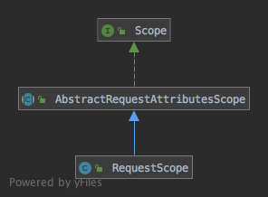

从笔记[如何实现请求的分发和响应](如何实现请求的分发和响应.md)可知，默认情况下SpringMVC的容器实现是[XmlWebApplicationContext]，其父类[AbstractRefreshableWebApplicationContext]重写了`postProcessBeanFactory()`方法，该方法会在容器调用`refresh()`时被调用，SpringMVC的Scope就是该方法注册的，代码：
```java
protected void postProcessBeanFactory(ConfigurableListableBeanFactory beanFactory) {
  beanFactory.addBeanPostProcessor(new ServletContextAwareProcessor(this.servletContext, this.servletConfig));
  beanFactory.ignoreDependencyInterface(ServletContextAware.class);
  beanFactory.ignoreDependencyInterface(ServletConfigAware.class);

  // 注册RequestScope、SessionScope、ServletContextScope
  WebApplicationContextUtils.registerWebApplicationScopes(beanFactory, this.servletContext);
  // 将servletContext、servletConfig、contextParameter、contextAttribute都作为bean添加到BeanFactory
  WebApplicationContextUtils.registerEnvironmentBeans(beanFactory, this.servletContext, this.servletConfig);
}

public static void registerWebApplicationScopes(ConfigurableListableBeanFactory beanFactory,
    @Nullable ServletContext sc) {

  beanFactory.registerScope(WebApplicationContext.SCOPE_REQUEST, new RequestScope());
  beanFactory.registerScope(WebApplicationContext.SCOPE_SESSION, new SessionScope());
  if (sc != null) {
    ServletContextScope appScope = new ServletContextScope(sc);
    beanFactory.registerScope(WebApplicationContext.SCOPE_APPLICATION, appScope);
    // Register as ServletContext attribute, for ContextCleanupListener to detect it.
    sc.setAttribute(ServletContextScope.class.getName(), appScope);
  }

  beanFactory.registerResolvableDependency(ServletRequest.class, new RequestObjectFactory());
  beanFactory.registerResolvableDependency(ServletResponse.class, new ResponseObjectFactory());
  beanFactory.registerResolvableDependency(HttpSession.class, new SessionObjectFactory());
  beanFactory.registerResolvableDependency(WebRequest.class, new WebRequestObjectFactory());
  if (jsfPresent) {
    FacesDependencyRegistrar.registerFacesDependencies(beanFactory);
  }
}
```

分别注册了[RequestScope]、[SessionScope]、[ServletContextScope]，对应的scope分别是`reqeust`、`session`、`application`，对于Spring中Scope的用法，可以看笔记[Spring的scope如何使用和实现](../../容器的使用/Spring的scope如何使用和实现.md)，这里直接分析这3个scope的源码，首先是[RequestScope]，[RequestScope]继承结构：


[AbstractRequestAttributesScope]实现了[Scope]接口的基本逻辑，代码：
```java
public abstract class AbstractRequestAttributesScope implements Scope {

	@Override
	public Object get(String name, ObjectFactory<?> objectFactory) {
		// 获取当前请求对应的RequestAttributes
		RequestAttributes attributes = RequestContextHolder.currentRequestAttributes();
		// RequestAttributes支持根据scope的值将bean保存到不同的地方，这里先尝试获取bean是否已经创建
		Object scopedObject = attributes.getAttribute(name, getScope());
		if (scopedObject == null) {
			// 没有创建则创建一个
			scopedObject = objectFactory.getObject();
			// 通过RequestAttributes保存bean
			attributes.setAttribute(name, scopedObject, getScope());
			// Retrieve object again, registering it for implicit session attribute updates.
			// As a bonus, we also allow for potential decoration at the getAttribute level.
			Object retrievedObject = attributes.getAttribute(name, getScope());
			if (retrievedObject != null) {
				// Only proceed with retrieved object if still present (the expected case).
				// If it disappeared concurrently, we return our locally created instance.
				scopedObject = retrievedObject;
			}
		}
		return scopedObject;
	}

	@Override
	@Nullable
	public Object remove(String name) {
		RequestAttributes attributes = RequestContextHolder.currentRequestAttributes();
		Object scopedObject = attributes.getAttribute(name, getScope());
		if (scopedObject != null) {
			attributes.removeAttribute(name, getScope());
			return scopedObject;
		}
		else {
			return null;
		}
	}

	@Override
	public void registerDestructionCallback(String name, Runnable callback) {
		RequestAttributes attributes = RequestContextHolder.currentRequestAttributes();
		attributes.registerDestructionCallback(name, callback, getScope());
	}

	@Override
	@Nullable
	public Object resolveContextualObject(String key) {
		RequestAttributes attributes = RequestContextHolder.currentRequestAttributes();
		// resolveReference方法在参数为"request"时返回request，在参数为"session"时返回session
		return attributes.resolveReference(key);
	}
  
	// 供子类实现，返回scope对应的标识
	protected abstract int getScope();
}
```

获取bean时首先获取了request对应的[RequestAttributes]，代码：
```java
public static RequestAttributes currentRequestAttributes() throws IllegalStateException {
  RequestAttributes attributes = getRequestAttributes();
  if (attributes == null) {
    if (jsfPresent) {
      attributes = FacesRequestAttributesFactory.getFacesRequestAttributes();
    }
    if (attributes == null) {
      throw new IllegalStateException("No thread-bound request found: " +
          "Are you referring to request attributes outside of an actual web request, " +
          "or processing a request outside of the originally receiving thread? " +
          "If you are actually operating within a web request and still receive this message, " +
          "your code is probably running outside of DispatcherServlet/DispatcherPortlet: " +
          "In this case, use RequestContextListener or RequestContextFilter to expose the current request.");
    }
  }
  return attributes;
}

public static RequestAttributes getRequestAttributes() {
  RequestAttributes attributes = requestAttributesHolder.get();
  if (attributes == null) {
    attributes = inheritableRequestAttributesHolder.get();
  }
  return attributes;
}
```

[RequestAttributes]保存在`requestAttributesHolder`或`inheritableRequestAttributesHolder`中，在每次分发请求时，[FrameworkServlet]都会创建一个[RequestAttributes]并保存到`requestAttributesHolder`或`inheritableRequestAttributesHolder`，代码：
```java
protected final void processRequest(HttpServletRequest request, HttpServletResponse response)
    throws ServletException, IOException {

  //...
  LocaleContext previousLocaleContext = LocaleContextHolder.getLocaleContext();
  LocaleContext localeContext = buildLocaleContext(request);

  // 同上
  RequestAttributes previousAttributes = RequestContextHolder.getRequestAttributes();
  // 返回new ServletRequestAttributes(request, response)
  ServletRequestAttributes requestAttributes = buildRequestAttributes(request, response, previousAttributes);

  // 获取request中的WebAsyncManager，如果没有则创建一个返回
  WebAsyncManager asyncManager = WebAsyncUtils.getAsyncManager(request);
  // 添加RequestBindingInterceptor，RequestBindingInterceptor的作用是执行请求时更新LocaleContext和RequestAttributes
  asyncManager.registerCallableInterceptor(FrameworkServlet.class.getName(), new RequestBindingInterceptor());

  // 保存localeContext和requestAttributes到对应的ThreadLocal
  initContextHolders(request, localeContext, requestAttributes);

  //...
}

private void initContextHolders(HttpServletRequest request,
    @Nullable LocaleContext localeContext, @Nullable RequestAttributes requestAttributes) {

  if (localeContext != null) {
    LocaleContextHolder.setLocaleContext(localeContext, this.threadContextInheritable);
  }
  if (requestAttributes != null) {
    // threadContextInheritable默认为false
    RequestContextHolder.setRequestAttributes(requestAttributes, this.threadContextInheritable);
  }
  if (logger.isTraceEnabled()) {
    logger.trace("Bound request context to thread: " + request);
  }
}

// RequestContextHolder的setRequestAttributes方法
public static void setRequestAttributes(@Nullable RequestAttributes attributes, boolean inheritable) {
  if (attributes == null) {
    resetRequestAttributes();
  }
  else {
    if (inheritable) {
      inheritableRequestAttributesHolder.set(attributes);
      requestAttributesHolder.remove();
    }
    else {
      requestAttributesHolder.set(attributes);
      inheritableRequestAttributesHolder.remove();
    }
  }
}
```

`processRequest()`方法每次执行请求前都会创建[LocaleContext]和[RequestAttributes]到`requestAttributesHolder`或`inheritableRequestAttributesHolder`，同时`processRequest()`方法还添加了个拦截器[RequestBindingInterceptor]，代码：
```java
private class RequestBindingInterceptor implements CallableProcessingInterceptor {

  @Override
  public <T> void preProcess(NativeWebRequest webRequest, Callable<T> task) {
    HttpServletRequest request = webRequest.getNativeRequest(HttpServletRequest.class);
    if (request != null) {
      HttpServletResponse response = webRequest.getNativeResponse(HttpServletResponse.class);
      initContextHolders(request, buildLocaleContext(request),
          buildRequestAttributes(request, response, null));
    }
  }
  @Override
  public <T> void postProcess(NativeWebRequest webRequest, Callable<T> task, Object concurrentResult) {
    HttpServletRequest request = webRequest.getNativeRequest(HttpServletRequest.class);
    if (request != null) {
      resetContextHolders(request, null, null);
    }
  }
}
```

可以看到每次执行请求前，[RequestBindingInterceptor]都会更新[LocaleContext]和[RequestAttributes]，回到[AbstractRequestAttributesScope]的`get()`方法，在获取到[RequestAttributes]后，尝试从其获取bean，如果返回空在则创建一个bean并调用`attributes.setAttribute(name, scopedObject, getScope())`保存到[RequestAttributes]中，代码：
```java
public void setAttribute(String name, Object value, int scope) {
  if (scope == SCOPE_REQUEST) {
    if (!isRequestActive()) {
      throw new IllegalStateException(
          "Cannot set request attribute - request is not active anymore!");
    }
    this.request.setAttribute(name, value);
  }
  else {
    HttpSession session = obtainSession();
    this.sessionAttributesToUpdate.remove(name);
    session.setAttribute(name, value);
  }
}
```

当scope是request时，保存到request的属性中，否则保存到session中，下面再看[RequestScope]和[SessionScope]的实现，这两个类都继承自[AbstractRequestAttributesScope]，代码：
```java
public class RequestScope extends AbstractRequestAttributesScope {

	@Override
	protected int getScope() {
		return RequestAttributes.SCOPE_REQUEST;
	}
  
	@Override
	@Nullable
	public String getConversationId() {
		return null;
	}
}

public class SessionScope extends AbstractRequestAttributesScope {

	@Override
	protected int getScope() {
		return RequestAttributes.SCOPE_SESSION;
	}

	@Override
	public String getConversationId() {
		return RequestContextHolder.currentRequestAttributes().getSessionId();
	}

	@Override
	public Object get(String name, ObjectFactory<?> objectFactory) {
		Object mutex = RequestContextHolder.currentRequestAttributes().getSessionMutex();
		synchronized (mutex) {
			return super.get(name, objectFactory);
		}
	}

	@Override
	@Nullable
	public Object remove(String name) {
		Object mutex = RequestContextHolder.currentRequestAttributes().getSessionMutex();
		synchronized (mutex) {
			return super.remove(name);
		}
	}

}
```

[RequestScope]和[SessionScope]的区别只在于[SessionScope]添加了一个锁，总结就是，对于scope为request的bean，保存到request的属性中，对于scope为session的bean，保存到session的属性中，而[ServletContextScope]的代码很简单：
```java
public class ServletContextScope implements Scope, DisposableBean {

	private final ServletContext servletContext;

	private final Map<String, Runnable> destructionCallbacks = new LinkedHashMap<>();


	/**
	 * Create a new Scope wrapper for the given ServletContext.
	 * @param servletContext the ServletContext to wrap
	 */
	public ServletContextScope(ServletContext servletContext) {
		Assert.notNull(servletContext, "ServletContext must not be null");
		this.servletContext = servletContext;
	}


	@Override
	public Object get(String name, ObjectFactory<?> objectFactory) {
		Object scopedObject = this.servletContext.getAttribute(name);
		if (scopedObject == null) {
			scopedObject = objectFactory.getObject();
			this.servletContext.setAttribute(name, scopedObject);
		}
		return scopedObject;
	}

	@Override
	@Nullable
	public Object remove(String name) {
		Object scopedObject = this.servletContext.getAttribute(name);
		if (scopedObject != null) {
			this.servletContext.removeAttribute(name);
			this.destructionCallbacks.remove(name);
			return scopedObject;
		}
		else {
			return null;
		}
	}

	@Override
	public void registerDestructionCallback(String name, Runnable callback) {
		this.destructionCallbacks.put(name, callback);
	}

	@Override
	@Nullable
	public Object resolveContextualObject(String key) {
		return null;
	}

	@Override
	@Nullable
	public String getConversationId() {
		return null;
	}


	/**
	 * Invoke all registered destruction callbacks.
	 * To be called on ServletContext shutdown.
	 * @see org.springframework.web.context.ContextCleanupListener
	 */
	@Override
	public void destroy() {
		for (Runnable runnable : this.destructionCallbacks.values()) {
			runnable.run();
		}
		this.destructionCallbacks.clear();
	}

}
```

可以看到，就是将bean保存在[ServletContext]中

[XmlWebApplicationContext]: aaa
[AbstractRefreshableWebApplicationContext]: aaa
[RequestScope]: aaa
[RequestAttributes]: aaa
[FrameworkServlet]: aaa
[ServletContext]: aaa