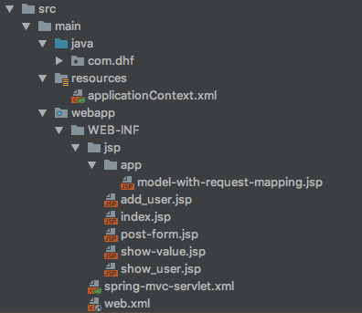

先看源码，最后再结合例子和源码分析，首先看之后将会讲到的例子中的xml配置：
```xml
<?xml version="1.0" encoding="UTF-8"?>
<beans xmlns="http://www.springframework.org/schema/beans" xmlns:xsi="http://www.w3.org/2001/XMLSchema-instance"
       xmlns:mvc="http://www.springframework.org/schema/mvc"
       xmlns:context="http://www.springframework.org/schema/context"
       xsi:schemaLocation="http://www.springframework.org/schema/beans http://www.springframework.org/schema/beans/spring-beans-4.0.xsd http://www.springframework.org/schema/mvc http://www.springframework.org/schema/mvc/spring-mvc.xsd http://www.springframework.org/schema/context http://www.springframework.org/schema/context/spring-context.xsd">

    <context:component-scan base-package="com.dhf"/>
    <mvc:annotation-driven/>

    <!--解决对象转json问题-->
    <bean class="org.springframework.web.servlet.mvc.method.annotation.RequestMappingHandlerAdapter">
        <property name="messageConverters">
            <list>
                <ref bean="jsonMessageConverter"/>
            </list>
        </property>
    </bean>

    <bean id="jsonMessageConverter"
          class="org.springframework.http.converter.json.MappingJackson2HttpMessageConverter"/>
</beans>
```

开启mvc的关键配置是`<mvc:annotation-driven/>`，对应的[NamespaceHandler]是[MvcNamespaceHandler]，代码：
```java
public class MvcNamespaceHandler extends NamespaceHandlerSupport {
	@Override
	public void init() {
		registerBeanDefinitionParser("annotation-driven", new AnnotationDrivenBeanDefinitionParser());
		registerBeanDefinitionParser("default-servlet-handler", new DefaultServletHandlerBeanDefinitionParser());
		registerBeanDefinitionParser("interceptors", new InterceptorsBeanDefinitionParser());
		registerBeanDefinitionParser("resources", new ResourcesBeanDefinitionParser());
		registerBeanDefinitionParser("view-controller", new ViewControllerBeanDefinitionParser());
		registerBeanDefinitionParser("redirect-view-controller", new ViewControllerBeanDefinitionParser());
		registerBeanDefinitionParser("status-controller", new ViewControllerBeanDefinitionParser());
		registerBeanDefinitionParser("view-resolvers", new ViewResolversBeanDefinitionParser());
		registerBeanDefinitionParser("tiles-configurer", new TilesConfigurerBeanDefinitionParser());
		registerBeanDefinitionParser("freemarker-configurer", new FreeMarkerConfigurerBeanDefinitionParser());
		registerBeanDefinitionParser("groovy-configurer", new GroovyMarkupConfigurerBeanDefinitionParser());
		registerBeanDefinitionParser("script-template-configurer", new ScriptTemplateConfigurerBeanDefinitionParser());
		registerBeanDefinitionParser("cors", new CorsBeanDefinitionParser());
	}
}
```

`annotation-driven`的解析由[AnnotationDrivenBeanDefinitionParser]完成，核心代码：
```java
@Override
@Nullable
public BeanDefinition parse(Element element, ParserContext parserContext) {
    Object source = parserContext.extractSource(element);
    XmlReaderContext readerContext = parserContext.getReaderContext();

    // 这里将compDefinition push保存下来，之后当前方法发起的注册事件都会被暂存到compDefinition的nestedComponents
    // 属性，在方法最后pop后会发起注册compDefinition的事件，此时compDefinition对象包含了当前方法发起的所有注册事件
    CompositeComponentDefinition compDefinition = new CompositeComponentDefinition(element.getTagName(), source);
    parserContext.pushContainingComponent(compDefinition);

    // 获取xml配置的content-negotiation-manager属性并返回bean引用，如果没有则添加并返回ContentNegotiationManagerFactoryBean的bean引用
    // ContentNegotiationManagerFactoryBean返回ContentNegotiationManager实例，ContentNegotiationManager用于返回指定request对应的MediaType
    // 如application/json
    RuntimeBeanReference contentNegotiationManager = getContentNegotiationManager(element, source, parserContext);

    // 创建RequestMappingHandlerMapping bean
    RootBeanDefinition handlerMappingDef = new RootBeanDefinition(RequestMappingHandlerMapping.class);
    handlerMappingDef.setSource(source);
    handlerMappingDef.setRole(BeanDefinition.ROLE_INFRASTRUCTURE);
    handlerMappingDef.getPropertyValues().add("order", 0);
    handlerMappingDef.getPropertyValues().add("contentNegotiationManager", contentNegotiationManager);

    if (element.hasAttribute("enable-matrix-variables")) {
        Boolean enableMatrixVariables = Boolean.valueOf(element.getAttribute("enable-matrix-variables"));
        handlerMappingDef.getPropertyValues().add("removeSemicolonContent", !enableMatrixVariables);
    }

    /*
    解析annotation-driven元素下的path-matching属性，并将相关配置添加到handlerMappingDef，如

    <mvc:annotation-driven>
    <mvc:path-matching
        suffix-pattern="true"
        trailing-slash="false"
        registered-suffixes-only="true"
        path-helper="pathHelper"
        path-matcher="pathMatcher"/>
    </mvc:annotation-driven>

        <bean id="pathHelper" class="org.example.app.MyPathHelper"/>
    <bean id="pathMatcher" class="org.example.app.MyPathMatcher"/>
     */
    configurePathMatchingProperties(handlerMappingDef, element, parserContext);
    // 将handlerMappingDef添加到容器
    readerContext.getRegistry().registerBeanDefinition(HANDLER_MAPPING_BEAN_NAME , handlerMappingDef);

    // 创建用于保存cors配置的bean，bean类型实际上是个LinkedHashMap，cors的配置名为key，值为value
    RuntimeBeanReference corsRef = MvcNamespaceUtils.registerCorsConfigurations(null, parserContext, source);
    // 保存cors配置bean到handlerMappingDef
    handlerMappingDef.getPropertyValues().add("corsConfigurations", corsRef);

    /*
    以上是配置RequestMappingHandlerMapping
     */

    // 如果xml配置了conversion-service则使用指定的bean返回，否则默认为FormattingConversionServiceFactoryBean
    RuntimeBeanReference conversionService = getConversionService(element, source, parserContext);
    // 同上，默认为OptionalValidatorFactoryBean
    RuntimeBeanReference validator = getValidator(element, source, parserContext);
    // 同上，默认为null
    RuntimeBeanReference messageCodesResolver = getMessageCodesResolver(element);

    // ConfigurableWebBindingInitializer用于维护上面配置的3个bean，方便获取
    RootBeanDefinition bindingDef = new RootBeanDefinition(ConfigurableWebBindingInitializer.class);
    bindingDef.setSource(source);
    bindingDef.setRole(BeanDefinition.ROLE_INFRASTRUCTURE);
    bindingDef.getPropertyValues().add("conversionService", conversionService);
    bindingDef.getPropertyValues().add("validator", validator);
    bindingDef.getPropertyValues().add("messageCodesResolver", messageCodesResolver);

    /*
    以上是配置ConfigurableWebBindingInitializer
     */

    // 如果xml配置了message-converters属性则使用相应的配置，否则默认添加若干个Converter，如
    // ByteArrayHttpMessageConverter、StringHttpMessageConverter、GsonHttpMessageConverter等
    // 用于从http input stream中获取数据并转换成指定类型，或将执行类型对象输入到http output stream
    ManagedList<?> messageConverters = getMessageConverters(element, source, parserContext);
    // 如果xml配置了argument-resolvers则返回对应配置的bean，否则为null，顾名思义，用于解析方法参数的
    ManagedList<?> argumentResolvers = getArgumentResolvers(element, parserContext);
    // 同上，检查xml中的return-value-handlers配置，如果没有则为null，用于处理方法返回值
    ManagedList<?> returnValueHandlers = getReturnValueHandlers(element, parserContext);
    // 如果配置了async-support则返回，否则如果配置了default-timeout则返回，否则返回null
    String asyncTimeout = getAsyncTimeout(element);
    // 当开启async-support配置时，如果配置了task-executor则返回对应的bean引用
    RuntimeBeanReference asyncExecutor = getAsyncExecutor(element);
    // 当开启async-support配置时，如果配置了callable-interceptors则返回对应的bean引用
    ManagedList<?> callableInterceptors = getCallableInterceptors(element, source, parserContext);
    // 当开启async-support配置时，如果配置了deferred-result-interceptors则返回对应的bean引用
    ManagedList<?> deferredResultInterceptors = getDeferredResultInterceptors(element, source, parserContext);

    // 创建RequestMappingHandlerAdapter bean
    RootBeanDefinition handlerAdapterDef = new RootBeanDefinition(RequestMappingHandlerAdapter.class);
    handlerAdapterDef.setSource(source);
    handlerAdapterDef.setRole(BeanDefinition.ROLE_INFRASTRUCTURE);
    handlerAdapterDef.getPropertyValues().add("contentNegotiationManager", contentNegotiationManager);
    handlerAdapterDef.getPropertyValues().add("webBindingInitializer", bindingDef);
    handlerAdapterDef.getPropertyValues().add("messageConverters", messageConverters);
    // 如果存在jackson相关类则添加JsonViewRequestBodyAdvice到handlerAdapterDef的requestBodyAdvice属性
    addRequestBodyAdvice(handlerAdapterDef);
    // 如果存在jackson相关类则添加JsonViewResponseBodyAdvice到handlerAdapterDef的responseBodyAdvice属性
    addResponseBodyAdvice(handlerAdapterDef);

    // 配置handlerAdapterDef的若干属性
    if (element.hasAttribute("ignore-default-model-on-redirect")) {
        Boolean ignoreDefaultModel = Boolean.valueOf(element.getAttribute("ignore-default-model-on-redirect"));
        handlerAdapterDef.getPropertyValues().add("ignoreDefaultModelOnRedirect", ignoreDefaultModel);
    }
    if (argumentResolvers != null) {
        handlerAdapterDef.getPropertyValues().add("customArgumentResolvers", argumentResolvers);
    }
    if (returnValueHandlers != null) {
        handlerAdapterDef.getPropertyValues().add("customReturnValueHandlers", returnValueHandlers);
    }
    if (asyncTimeout != null) {
        handlerAdapterDef.getPropertyValues().add("asyncRequestTimeout", asyncTimeout);
    }
    if (asyncExecutor != null) {
        handlerAdapterDef.getPropertyValues().add("taskExecutor", asyncExecutor);
    }

    handlerAdapterDef.getPropertyValues().add("callableInterceptors", callableInterceptors);
    handlerAdapterDef.getPropertyValues().add("deferredResultInterceptors", deferredResultInterceptors);
    readerContext.getRegistry().registerBeanDefinition(HANDLER_ADAPTER_BEAN_NAME , handlerAdapterDef);

    /*
    以上是配置RequestMappingHandlerAdapter
     */

    // 创建CompositeUriComponentsContributorFactoryBean bean
    RootBeanDefinition uriContributorDef =
            new RootBeanDefinition(CompositeUriComponentsContributorFactoryBean.class);
    uriContributorDef.setSource(source);
    uriContributorDef.getPropertyValues().addPropertyValue("handlerAdapter", handlerAdapterDef);
    uriContributorDef.getPropertyValues().addPropertyValue("conversionService", conversionService);
    String uriContributorName = MvcUriComponentsBuilder.MVC_URI_COMPONENTS_CONTRIBUTOR_BEAN_NAME;
    readerContext.getRegistry().registerBeanDefinition(uriContributorName, uriContributorDef);

    // 添加ConversionServiceExposingInterceptor和MappedInterceptor bean
    RootBeanDefinition csInterceptorDef = new RootBeanDefinition(ConversionServiceExposingInterceptor.class);
    csInterceptorDef.setSource(source);
    csInterceptorDef.getConstructorArgumentValues().addIndexedArgumentValue(0, conversionService);
    RootBeanDefinition mappedInterceptorDef = new RootBeanDefinition(MappedInterceptor.class);
    mappedInterceptorDef.setSource(source);
    mappedInterceptorDef.setRole(BeanDefinition.ROLE_INFRASTRUCTURE);
    mappedInterceptorDef.getConstructorArgumentValues().addIndexedArgumentValue(0, (Object) null);
    mappedInterceptorDef.getConstructorArgumentValues().addIndexedArgumentValue(1, csInterceptorDef);
    // 将mappedInterceptorDef添加到beanFactory，beanName自动生成
    String mappedInterceptorName = readerContext.registerWithGeneratedName(mappedInterceptorDef);

    // 添加ExceptionHandlerExceptionResolver bean
    RootBeanDefinition methodExceptionResolver = new RootBeanDefinition(ExceptionHandlerExceptionResolver.class);
    methodExceptionResolver.setSource(source);
    methodExceptionResolver.setRole(BeanDefinition.ROLE_INFRASTRUCTURE);
    methodExceptionResolver.getPropertyValues().add("contentNegotiationManager", contentNegotiationManager);
    methodExceptionResolver.getPropertyValues().add("messageConverters", messageConverters);
    methodExceptionResolver.getPropertyValues().add("order", 0);
    addResponseBodyAdvice(methodExceptionResolver);
    if (argumentResolvers != null) {
        methodExceptionResolver.getPropertyValues().add("customArgumentResolvers", argumentResolvers);
    }
    if (returnValueHandlers != null) {
        methodExceptionResolver.getPropertyValues().add("customReturnValueHandlers", returnValueHandlers);
    }
    String methodExResolverName = readerContext.registerWithGeneratedName(methodExceptionResolver);

    // 添加ResponseStatusExceptionResolver bean
    RootBeanDefinition statusExceptionResolver = new RootBeanDefinition(ResponseStatusExceptionResolver.class);
    statusExceptionResolver.setSource(source);
    statusExceptionResolver.setRole(BeanDefinition.ROLE_INFRASTRUCTURE);
    statusExceptionResolver.getPropertyValues().add("order", 1);
    String statusExResolverName = readerContext.registerWithGeneratedName(statusExceptionResolver);

    // 添加DefaultHandlerExceptionResolver bean
    RootBeanDefinition defaultExceptionResolver = new RootBeanDefinition(DefaultHandlerExceptionResolver.class);
    defaultExceptionResolver.setSource(source);
    defaultExceptionResolver.setRole(BeanDefinition.ROLE_INFRASTRUCTURE);
    defaultExceptionResolver.getPropertyValues().add("order", 2);
    String defaultExResolverName = readerContext.registerWithGeneratedName(defaultExceptionResolver);

    // 发起bean的注册事件
    parserContext.registerComponent(new BeanComponentDefinition(handlerMappingDef, HANDLER_MAPPING_BEAN_NAME));
    parserContext.registerComponent(new BeanComponentDefinition(handlerAdapterDef, HANDLER_ADAPTER_BEAN_NAME));
    parserContext.registerComponent(new BeanComponentDefinition(uriContributorDef, uriContributorName));
    parserContext.registerComponent(new BeanComponentDefinition(mappedInterceptorDef, mappedInterceptorName));
    parserContext.registerComponent(new BeanComponentDefinition(methodExceptionResolver, methodExResolverName));
    parserContext.registerComponent(new BeanComponentDefinition(statusExceptionResolver, statusExResolverName));
    parserContext.registerComponent(new BeanComponentDefinition(defaultExceptionResolver, defaultExResolverName));

    // Ensure BeanNameUrlHandlerMapping (SPR-8289) and default HandlerAdapters are not "turned off"
    // 确保BeanNameUrlHandlerMapping、HttpRequestHandlerAdapter、SimpleControllerHandlerAdapter和HandlerMappingIntrospector
    // 这4个bean已注册，不存在则注册
    MvcNamespaceUtils.registerDefaultComponents(parserContext, source);

    parserContext.popAndRegisterContainingComponent();

    return null;
}

```

[AnnotationDrivenBeanDefinitionParser]添加了若干个bean，每个bean都有不同的功能，涉及到的类很多，这里对重要的类进行分析：
- [RequestMappingHandlerMapping的实现](RequestMappingHandlerMapping的实现.md)
- todo


下面是例子：

文件结构：


主要文件内容：

applicationContext.xml文件：
```xml
<?xml version="1.0" encoding="UTF-8"?>
<beans xmlns="http://www.springframework.org/schema/beans" xmlns:xsi="http://www.w3.org/2001/XMLSchema-instance"
       xmlns:mvc="http://www.springframework.org/schema/mvc"
       xmlns:context="http://www.springframework.org/schema/context"
       xsi:schemaLocation="http://www.springframework.org/schema/beans http://www.springframework.org/schema/beans/spring-beans-4.0.xsd http://www.springframework.org/schema/mvc http://www.springframework.org/schema/mvc/spring-mvc.xsd http://www.springframework.org/schema/context http://www.springframework.org/schema/context/spring-context.xsd">

    <context:component-scan base-package="com.dhf"/>
    <mvc:annotation-driven/>

    <!--解决对象转json问题-->
    <bean class="org.springframework.web.servlet.mvc.method.annotation.RequestMappingHandlerAdapter">
        <property name="messageConverters">
            <list>
                <ref bean="jsonMessageConverter"/>
            </list>
        </property>
    </bean>

    <bean id="jsonMessageConverter"
          class="org.springframework.http.converter.json.MappingJackson2HttpMessageConverter"/>
</beans>
```

model-with-request-mapping.jsp
```jsp
<%@taglib uri="http://www.springframework.org/tags/form" prefix="form" %>
<html>
<body>
<h1><%= request.getAttribute("demoModelKey3")%></h1>
</body>
</html>
```

index.jsp
```jsp
<%@ page language="java" contentType="text/html; charset=UTF-8"
         pageEncoding="UTF-8" %>
<!DOCTYPE html PUBLIC "-//W3C//DTD HTML 4.01 Transitional//EN" "http://www.w3.org/TR/html4/loose.dtd">
<html>
<body>
${request.demoModelKey}<br>
<br>
</body>
</html>
```

post-form.jsp
```jsp
<%@taglib uri="http://www.springframework.org/tags/form" prefix="form" %>
<html>
<body>
<form:form action="/app/test/show-post-body" method="post" modelAttribute="userModel">
    <table>
        <tr>
            <td><form:label path="name">Name</form:label></td>
            <td><form:input path="name"/></td>
        </tr>
        <tr>
            <td><form:label path="age">Age</form:label></td>
            <td><form:input path="age"/></td>
        </tr>
        <tr>
            <td colspan="2"><input type="submit" value="Post User"/>
            </td>
        </tr>
    </table>
</form:form>
</body>
</html>
```

show-value.jsp
```jsp
<%@taglib uri="http://www.springframework.org/tags/form" prefix="form" %>
<%@ taglib prefix="c" uri="http://java.sun.com/jsp/jstl/core" %>
<html>
<body>
<h1>Session Value</h1>

<c:forEach var="v" items="${values}">
    <table>
        <tr>
            <td>${v}</td>
        </tr>
    </table>
</c:forEach>

</body>
</html>
```

AppController.java
```java
@Controller
@RequestMapping("/app")
@SessionAttributes(value = {"key1", "key2"})
public class AppController {
    @RequestMapping(value = "index", method = RequestMethod.GET)
    public String index(@ModelAttribute("user") User user) {
        user.setName("test");
        return "index";
    }

    @ResponseBody
    @RequestMapping(value = "/rest/index", method = RequestMethod.GET)
    public String restIndex(@ModelAttribute("user") User user) {
        user.setName("test");
        return "index";
    }

    //---------------------------------------------------------------------
    // 开始SessionAttributes、RequestParam注解测试
    //---------------------------------------------------------------------

    @RequestMapping(value="/add-session-value")
    public ModelAndView addSessionValue() {
        ModelAndView modelAndView = new ModelAndView();
        modelAndView.setViewName("forward:show-value?a=1&b=2");
        modelAndView.addObject("key1", "key1Value");
        modelAndView.addObject("key2", "key2Value");
        return modelAndView;
    }

    @GetMapping(value="/show-value")
    public ModelAndView showSessionValue(@ModelAttribute("key1") String key1,
                                         @ModelAttribute("key2") String key2,
                                         @RequestHeader("User-Agent") String userAgent,
                                         @CookieValue("JSESSIONID") String jSessionId,
                                         @RequestParam String a,
                                         @RequestParam String b) {
        ModelAndView modelAndView = new ModelAndView();
        modelAndView.setViewName("show-value");
        modelAndView.addObject("values", Arrays.asList(key1, key2, userAgent, jSessionId, a, b));
        return modelAndView;
    }

    //---------------------------------------------------------------------
    // 结束SessionAttributes、RequestParam注解测试
    //---------------------------------------------------------------------


    //---------------------------------------------------------------------
    // 开始ResponseBody、ModelAttribute、PathVariable注解测试
    //---------------------------------------------------------------------

    // 这里只在方法上添加了ModelAttribute注解，这将使得当前类上所有请求方法在被执行前都会调用一次nameModelReturnString方法，调用的效果是，会创建一个名叫
    // name的model属性，值为nameModelReturnString方法的返回值，这里nameModelReturnString方法的返回值是RequestParam注解的值，也就是请求路径中的查询参数test的值，
    // 如/app/index?test=abc
    @ModelAttribute("demoModelKey1")
    public String nameModelReturnString(
            @RequestParam(value = "test", required = false) String test){
        return test;
    }

    // 这里和nameModelReturnString方法做的事差不多，只不过添加model的方法变成了直接设置到参数model对象上，当前类的所有请求方法在执行前都会调用nameModelReturnString和nameModelReturnVoid方法，
    // 按照声明顺序调用
    @ModelAttribute
    public void nameModelReturnVoid(
            @RequestParam(value = "test", required = false) String test,
            Model model){
        model.addAttribute("demoModelKey2", test);
        model.addAttribute("age", 123);
    }

    // 这里也是做的差不多的事，model属性的名称等于返回值的类型名，这里就是string
    @ModelAttribute
    public String nameModelReturnString(){
        return "dhf";
    }

    // 这里就和上面的只有ModelAttribute注解的方法不一样了，该方法还有一个RequestMapping注解，所以这也是一个请求方法，该方法的特点是，会
    // 创建一个key为demoModelKey的model，值为方法的返回值，并且最后还会访问RequestMapping注解的值对应的视图，视图路径是请求的相对路径，
    // 既/app/model-with-request-mapping，所以效果是，浏览器访问/app/model-with-request-mapping，该请求被执行，创建一个model，并返回
    // 视图WEB-INF/jsp/app/model-with-request-mapping.jsp
    @ModelAttribute(value = "demoModelKey3")
    @RequestMapping(value = "/model-with-request-mapping")
    public String nameModelWithRequestMapping(){
        return "demoModelValue3";
    }

    // 这里的作用是添加一个名叫userModel的User到model，和showUser方法相呼应，showUser方法也有一个ModelAttribute注解，值为userModel，
    // 这将使得showUser方法被调用时user参数被赋值为这里创建的user
    @ModelAttribute("userModel")
    public User nameModelReturnUser(){
        User user = new User();
        // 这里设置了customs，在showUser中不用再设置了，同时这里也只设置了customs，没有设置name和age，允许测试调用http://localhost:8080/app/show-post-form
        // 后填写表单提交后可以发现，showUser的userModel值会同时拥有这里设置的customs属性和页面设置的name、age属性
        user.setCustoms(new ArrayList<>(Arrays.asList("demo1", "demo2")));
        return user;
    }

    // 必须添加一个user到model，否则post-form.jsp报错
    @GetMapping(value="/show-post-form")
    public String showPostForm(@ModelAttribute("userModel") User user, @ModelAttribute("age") Integer age) {
        user.setAge(age);
        return "post-form";
    }

    @ResponseBody
    @RequestMapping(value = "/{test}/show-post-body", method = RequestMethod.POST)
    public User showUser(@ModelAttribute("userModel") User userModel, @PathVariable String test, @ModelAttribute("string") String string) {
        userModel.getCustoms().addAll(Arrays.asList(test, string));
        return userModel;
    }

    //---------------------------------------------------------------------
    // 结束ResponseBody、ModelAttribute、PathVariable注解测试
    //---------------------------------------------------------------------
}
```


[AppController]: aaa