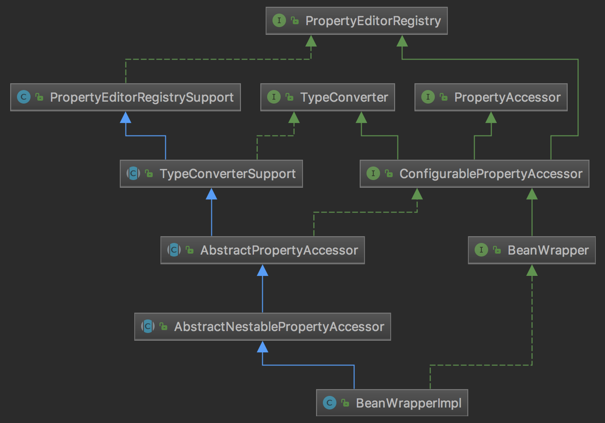

起点在spring的属性注入过程中执行的`autowireByType()`方法，代码该方法涉及到了多个类，这里对这些类的作用进行分析，`autowireByType()`方法代码：
```java
protected void  autowireByType(
        String beanName, AbstractBeanDefinition mbd, BeanWrapper bw, MutablePropertyValues pvs) {

    TypeConverter converter = getCustomTypeConverter();
    if (converter == null) {
        converter = bw;
    }

    Set<String> autowiredBeanNames = new LinkedHashSet<>(4);
    // 获取满足自动注入条件的属性名称
    String[] propertyNames = unsatisfiedNonSimpleProperties(mbd, bw);
    for (String propertyName : propertyNames) {
        try {
            /*
             PropertyDescriptor是JDK中的类，通过该类可以读写一个JavaBean的某个属性，常用的构造函数：
             public PropertyDescriptor(String propertyName, Class<?> beanClass)
             public PropertyDescriptor(String propertyName, Class<?> beanClass, String readMethodName, String writeMethodName)
             public PropertyDescriptor(String propertyName, Method readMethod, Method writeMethod)
             */
            PropertyDescriptor pd = bw.getPropertyDescriptor(propertyName);
            // Don't try autowiring by type for type Object: never makes sense,
            // even if it technically is a unsatisfied, non-simple property.
            if (Object.class != pd.getPropertyType()) {
                MethodParameter methodParam = BeanUtils.getWriteMethodParameter(pd);
                // Do not allow eager init for type matching in case of a prioritized post-processor.
                boolean eager = !PriorityOrdered.class.isInstance(bw.getWrappedInstance());
                DependencyDescriptor desc = new AutowireByTypeDependencyDescriptor(methodParam, eager);
                Object autowiredArgument = resolveDependency(desc, beanName, autowiredBeanNames, converter);
                if (autowiredArgument != null) {
                    pvs.add(propertyName, autowiredArgument);
                }
                for (String autowiredBeanName : autowiredBeanNames) {
                    registerDependentBean(autowiredBeanName, beanName);
                    if (logger.isDebugEnabled()) {
                        logger.debug("Autowiring by type from bean name '" + beanName + "' via property '" +
                                propertyName + "' to bean named '" + autowiredBeanName + "'");
                    }
                }
                autowiredBeanNames.clear();
            }
        }
        catch (BeansException ex) {
            throw new UnsatisfiedDependencyException(mbd.getResourceDescription(), beanName, propertyName, ex);
        }
    }
}
```

首先是[BeanWrapper]接口的实现类[BeanWrapperImpl]，，